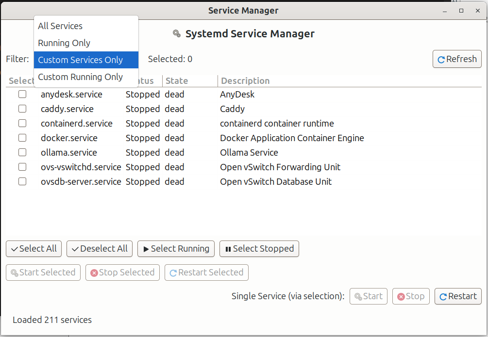

# Service Manager

A GTK3-based GUI application for monitoring and controlling systemd services on Ubuntu/Linux desktop systems.


## Features

- **Service Monitoring**: View all running systemd services with real-time status updates
- **Multi-Select Operations**: Select multiple services and start/stop/restart them in a single action
- **Smart Filtering**: Filter services by:
  - All Services
  - Running Only
  - Custom Services Only (non-default Ubuntu services)
  - Custom Running Only
- **Bulk Operations**: Execute commands on multiple services with single authentication
- **Auto-Refresh**: Automatically refreshes service status every 30 seconds
- **Context Menu**: Right-click for quick access to service actions
- **Selection Tools**: Quick select all, deselect all, select running, or select stopped services

## Screenshots




## Requirements

- Ubuntu 18.04+ or any Linux distribution with systemd
- Python 3.8+
- GTK 3.0
- PyGObject (python3-gi)
- polkit (for privilege escalation)

## Installation

### Quick Start

```bash
# Clone the repository
git clone https://github.com/yourusername/service-manager.git
cd service-manager

# Make the script executable
chmod +x service_manager.py
chmod +x run_service_manager.sh

# Run the application
./run_service_manager.sh
```

### Install Dependencies (if not already installed)

```bash
# Ubuntu/Debian
sudo apt update
sudo apt install python3-gi python3-gi-cairo gir1.2-gtk-3.0 polkit

# Fedora
sudo dnf install python3-gobject gtk3 polkit

# Arch Linux
sudo pacman -S python-gobject gtk3 polkit
```

### Desktop Integration

To add Service Manager to your applications menu:

```bash
# Copy desktop file to applications directory
cp service-manager.desktop ~/.local/share/applications/

# Update desktop database
update-desktop-database ~/.local/share/applications/
```

## Usage

### Running the Application

```bash
# Method 1: Direct Python execution
python3 service_manager.py

# Method 2: Using the launcher script
./run_service_manager.sh

# Method 3: From Applications menu (after desktop integration)
# Search for "Service Manager"
```

### Basic Operations

1. **Select Services**: Use checkboxes to select one or more services
2. **Quick Select**: Use the selection buttons:
   - **Select All** - Select all visible services
   - **Deselect All** - Clear all selections
   - **Select Running** - Select all running services
   - **Select Stopped** - Select all stopped services
3. **Bulk Actions**: Click Start/Stop/Restart to perform actions on selected services
4. **Single Service**: Use the "Single Service" row for individual operations
5. **Right-Click Menu**: Right-click on any service for context menu options

### Filters

- **All Services**: Show all systemd services
- **Running Only**: Show only currently running services
- **Custom Services Only**: Show non-default Ubuntu services (default view)
- **Custom Running Only**: Show only running custom services

## Default vs Custom Services

The application distinguishes between:

### Default Ubuntu Desktop Services
Standard services that come with Ubuntu Desktop:
- accounts-daemon, avahi-daemon, bluetooth, cups, dbus
- gdm, NetworkManager, systemd-*, and more

### Custom Services
Third-party or user-installed services:
- anydesk, caddy, docker, ollama
- ovs-vswitchd, virtlockd, and more

This helps you focus on services you've added to your system.

## Project Structure

```
service-manager/
├── service_manager.py      # Main application
├── run_service_manager.sh  # Launcher script
├── service-manager.desktop # Desktop integration file
├── README.md               # This file
├── LICENSE                 # MIT License
├── CONTRIBUTING.md         # Contribution guidelines
├── CHANGELOG.md            # Version history
└── screenshots/            # Application screenshots
```

## Development

### Running from Source

```bash
# Clone and enter directory
git clone https://github.com/yourusername/service-manager.git
cd service-manager

# Run directly
python3 service_manager.py
```

### Code Style

- Follow PEP 8 guidelines
- Use type hints where appropriate
- Add docstrings for public methods
- Keep functions focused and modular

### Architecture

The application uses:
- **GTK 3** for the user interface
- **Threading** for non-blocking service operations
- **subprocess** for systemctl commands
- **polkit** for privilege escalation

## Troubleshooting

### Application won't start

```bash
# Check Python version
python3 --version  # Should be 3.8+

# Check GTK installation
python3 -c "import gi; gi.require_version('Gtk', '3.0'); print('OK')"
```

### Permission denied errors

The application uses `pkexec` for privilege escalation. Make sure polkit is installed and running:

```bash
# Check polkit status
systemctl status polkit

# Install if missing
sudo apt install polkit
```

### Services not updating

- Click the **Refresh** button
- Wait for auto-refresh (30 seconds)
- Check if systemctl is working: `systemctl list-units --type=service`

### Icons not displaying

Some icon themes may not have all icons. The application uses standard GTK icons:
- system-run
- process-stop
- view-refresh
- object-select
- media-playback-start
- media-playback-pause

## Contributing

We welcome contributions! Please see [CONTRIBUTING.md](CONTRIBUTING.md) for details.

### Ways to Contribute

- Report bugs
- Suggest features
- Submit pull requests
- Improve documentation
- Add translations

## License

This project is licensed under the MIT License - see the [LICENSE](LICENSE) file for details.

## Acknowledgments

- GTK Team for the excellent GUI toolkit
- systemd developers
- Ubuntu community

## Support

- **Issues**: [GitHub Issues](https://github.com/yourusername/service-manager/issues)
- **Discussions**: [GitHub Discussions](https://github.com/yourusername/service-manager/discussions)

## Version History

See [CHANGELOG.md](CHANGELOG.md) for detailed version history.

---

**Made with ❤️ for the Linux community**
